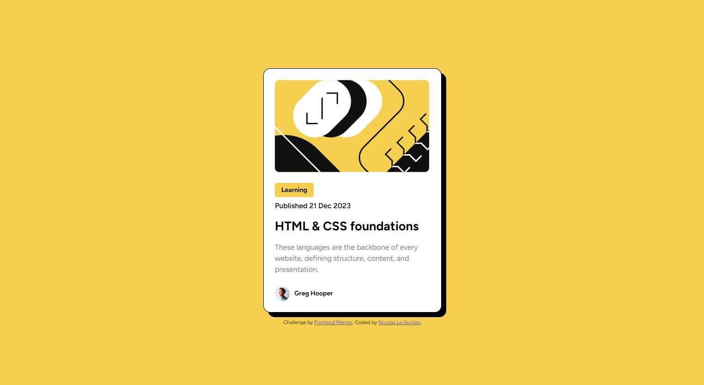

# Frontend Mentor - Blog preview card solution

This is a solution to the [Blog preview card challenge on Frontend Mentor](https://www.frontendmentor.io/challenges/blog-preview-card-ckPaj01IcS). Frontend Mentor challenges help you improve your coding skills by building realistic projects. 

## Table of contents

- [Overview](#overview)
  - [The challenge](#the-challenge)
  - [Screenshot](#screenshot)
  - [What I learned](#what-i-learned)

**Note: Delete this note and update the table of contents based on what sections you keep.**

## Overview

### The challenge

Users should be able to:

- See hover and focus states for all interactive elements on the page

### Screenshot




### What I learned

I learned how to do a hover animation with css :

```js
document.querySelectorAll('.card h1 a').forEach(function(anchor) {
    anchor.addEventListener('mouseover', function() {
        this.closest('.card').classList.add('hovered');
    });
    anchor.addEventListener('mouseout', function() {
        this.closest('.card').classList.remove('hovered');
    });
});
```